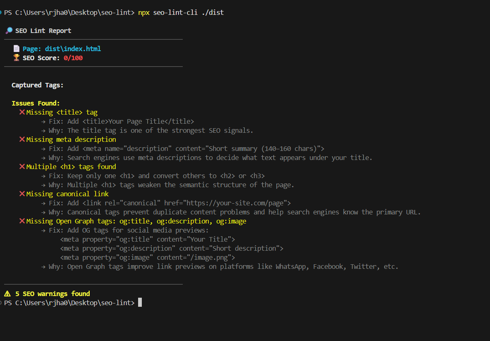
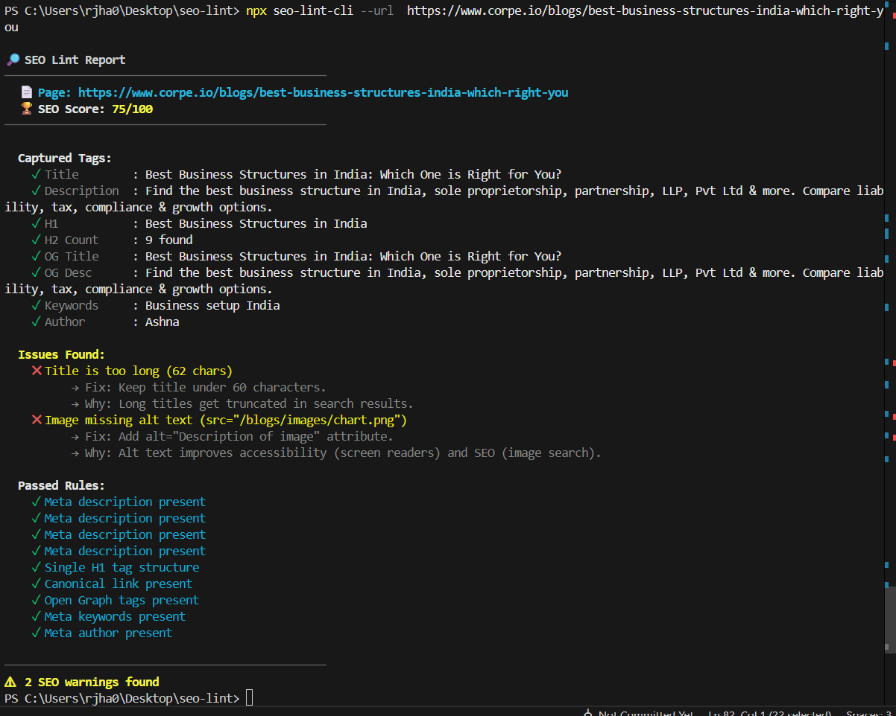

# SEO Lint CLI 🚀

[](https://www.npmjs.com/package/seo-lint-cli)
[](https://opensource.org/licenses/MIT)
[](https://www.npmjs.com/package/seo-lint-cli)

> **A developer-friendly SEO linting tool for keeping your static sites and live URLs search-engine optimized.**  
> Now with **SEO Scoring (0-100)** and **Quality Checks**! 🏆

## SEO‑LINTER

**Catch SEO mistakes before you deploy your static site.**

Most developers ship websites with broken or incomplete SEO — missing meta tags, bad titles, duplicate descriptions — and only notice after publishing.  
**SEO‑LINTER** is a CLI tool that audits static HTML files locally and warns you about SEO issues before your site goes live.

### ✨ New in v0.1.8
- **🏆 SEO Scoring**: Get a grade from 0-100 for every page.
- **📏 Quality Checks**: Validates Title & Description lengths (not too short, not too long).
- **🖼️ Image Accessibility**: Checks for missing `alt` text on images.
- **🏷️ New Rules**: Now checks for `meta keywords` and `meta author`.
- **📊 Unified Report**: See all your passed rules and captured metadata in one beautiful view.

---

### Recommended way to use (no global install)

You do not need to install anything globally.  
👉 **Always prefer npx — it runs the latest version directly.**

```bash
npx seo-lint-cli --help
```

---

## Common Use Cases (Step by Step)

### Case 1: Check a local build folder (most common)

If you’re using React / Vite / Next.js (static export):

**Step 1: Build your project**
```bash
npm run build
```
*(This usually creates a folder like `dist/`, `build/`, or `out/`)*

**Step 2: Run SEO-LINTER on the build output**
```bash
npx seo-lint-cli ./dist
```

**Example output:**
```text
🔎 SEO Lint Report
────────────────────────────────────────────────
  📄 Page: index.html
  🏆 SEO Score: 85/100
────────────────────────────────────────────────
  Captured Tags:
    ✓ Title        : My Awesome Portfolio
    ✓ Description  : A portfolio for a senior developer...
  
  Issues Found:
    ✖ Image missing alt text (src="/me.png")
          → Fix: Add alt="Portrait of me" attribute.

  Passed Rules:
    ✓ Meta description present
    ✓ Canonical link present
    ...
```
 screenshot:
---

### Case 2: Check a single live URL

If your site is already deployed and you want to test one page:

```bash
npx seo-lint-cli --url https://example.com
```
*This checks SEO issues for one page only.*
   screenshot:
---

### Case 3: Check multiple URLs at once (bulk scan)

If you want to scan multiple pages together:

**Step 1: Create a file `urls.txt`**  
*(one URL per line)*
```text
https://example.com
https://example.com/about
https://example.com/blog
```

**Step 2: Run the bulk scan command**
```bash
npx seo-lint-cli --urls urls.txt
```

*This is useful for blogs, multi-page sites, and auditing several routes together.*

---

## What SEO-LINTER checks (v0.1.8)

| Check | What it does |
| :--- | :--- |
| **Title Tag** | Checks if present. **New:** Checks optimal length (10-60 chars). |
| **Meta Description** | Checks if present. **New:** Checks optimal length (50-160 chars). |
| **H1 Tag** | Checks for exactly one `<h1>` per page. |
| **Canonical Link** | Ensures a canonical URL is set to prevent duplicate content issues. |
| **Open Graph** | Validates `og:title`, `og:description`, and `og:image` for social previews. |
| **Meta Keywords** | **New:** Checks if `keywords` meta tag is present. |
| **Meta Author** | **New:** Checks if `author` meta tag is present. |
| **Image Alt Text** | **New:** Ensures all images have `alt` descriptions for accessibility. |

> This tool focuses on early, obvious SEO mistakes — not advanced SEO analytics.

---

## 🛠️ Development & Contributing

Want to help improve SEO-LINT? We love contributions!

### How to Setup locally
1. **Fork the repo** to your GitHub account.
2. **Clone your fork**:
   ```bash
   git clone https://github.com/Rohan-2601/SEO-LINTER.git
   cd seo-lint-cli
   ```
3. **Install dependencies**:
   ```bash
   npm install
   ```

### How to Run Locally
Test your changes without installing globally:
```bash
# Test on a URL
node bin/cli.js --url https://example.com

# Test on a local folder
node bin/cli.js ./dist
```

### How to Raise a PR
1. Create a new branch: `git checkout -b feature/my-new-feature`
2. Make your changes and commit.
3. Push to your fork and **Open a Pull Request**.
4. **Screenshots**: Yes! Please attach screenshots or videos of your changes in the PR description so we can see the effect.

### Feedback
- Found a bug? → [Open an issue](https://github.com/Rohan-2601/SEO-LINTER/issues)   
- Have an idea? → Start a discussion
- **PRs are welcome!**

**If this helped you, consider starring the repo ⭐**

### License
MIT
